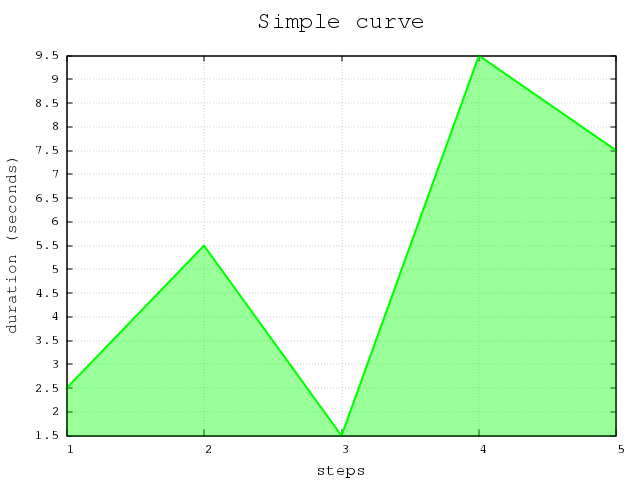

# Welcome to some examples on gnuplot

## Generating a simple curve
The main adjustments for this curve:

 * main title above graph
 * tixs on x-axis and y-axis (steps)
 * title on x-axis and y-axis
 * displaying a grid
 * Filled area under the curve
 * Line color
 * Plotting from a list of data
 * The **all in one** script: [here](examples/gp_simple_curve.sh)

## Smooth bezier curve

Just putting a `smooth bezier` in front of the **with filledcurves** the
simple curve examples looks like following:

